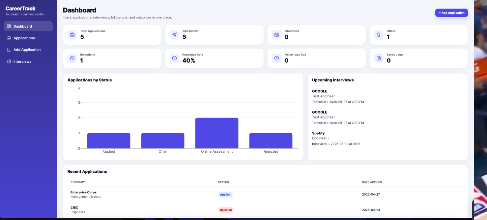
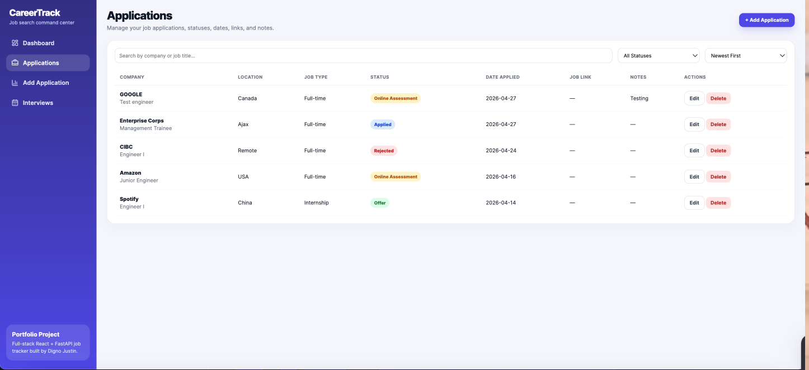
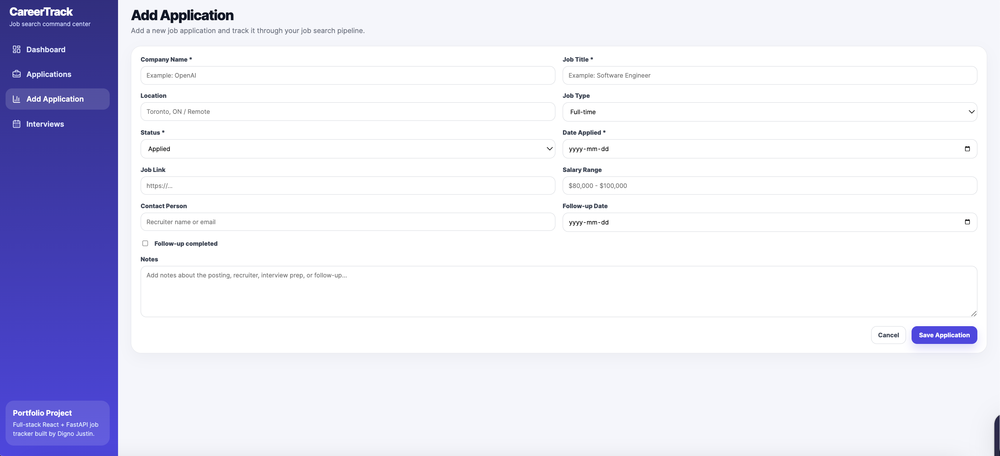
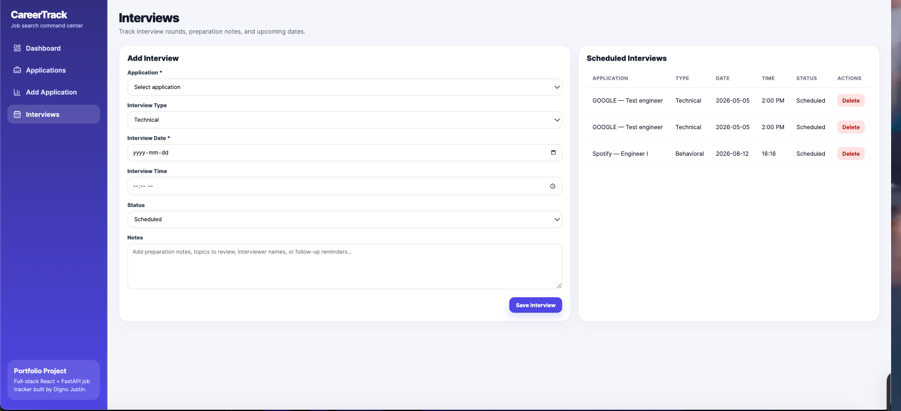
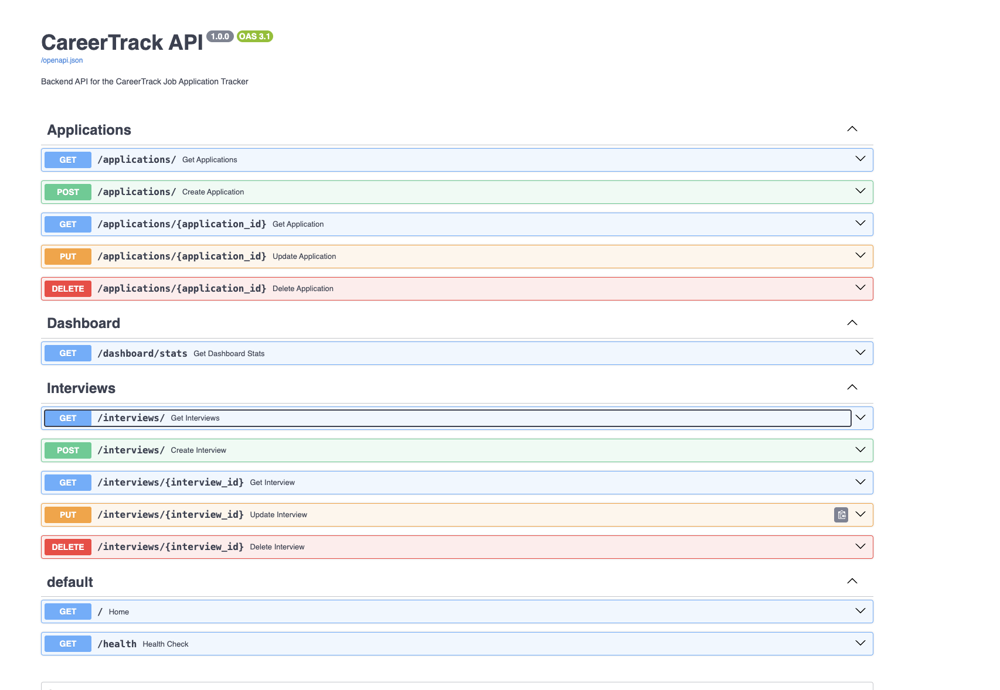

# CareerTrack — Full-Stack Job Application Tracker

CareerTrack is a full-stack job application tracking platform built with React, FastAPI, and SQLite. It helps users manage job applications, interview schedules, follow-ups, and application outcomes from a clean dashboard interface.

## Features

- Dashboard with application statistics
- Add, edit, delete, search, filter, and sort job applications
- Track application statuses such as Saved, Applied, Online Assessment, Interview, Offer, and Rejected
- Store job posting links, salary range, contact person, notes, and follow-up dates
- Interview tracker linked to job applications
- Upcoming interviews displayed on the dashboard
- REST API built with FastAPI
- SQLite database persistence
- Modern React SaaS-style user interface


Tech Stack

### Frontend

- React
- Vite
- React Router
- Axios
- Recharts
- Lucide React
- CSS

### Backend

- Python
- FastAPI
- SQLAlchemy
- SQLite
- Uvicorn
- Pydantic

## Project Structure

```text
careertrack/
  backend/
    main.py
    database.py
    models.py
    schemas.py
    routes/
      applications.py
      dashboard.py
      interviews.py
  frontend/
    src/
      components/
      pages/
      services/
      App.jsx
      main.jsx
      index.css
  README.md


  ## Screenshots

### Dashboard



### Applications Page



### Add Application Form



### Interviews Page



### API Documentation

